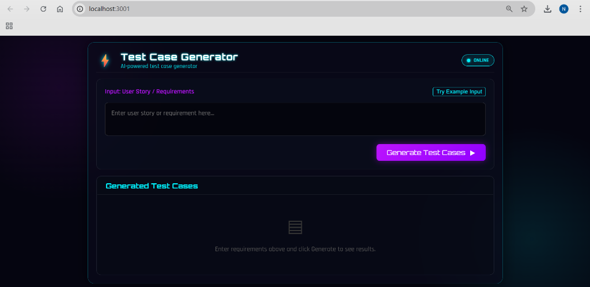
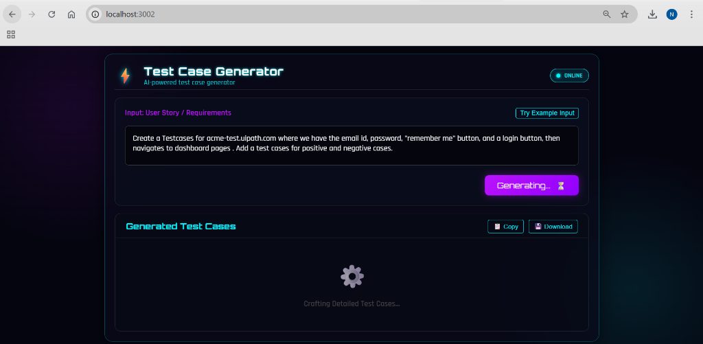
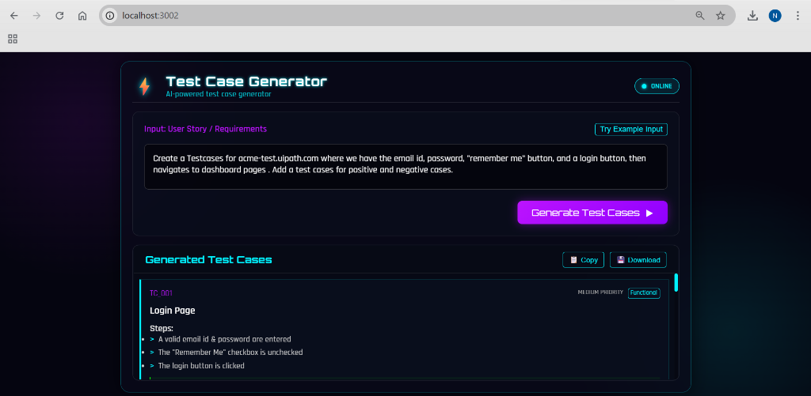
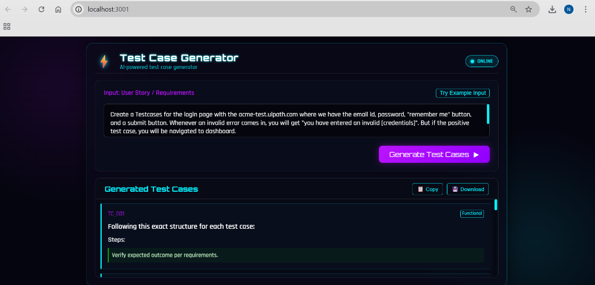

# ⚡ Local Test Case Generator (BLAST)

A privacy-focused, offline-capable AI tool for generating comprehensive software test cases. Built with the **BLAST** protocol (Blueprint, Link, Architect, Stylize, Trigger), this tool leverages a local **Ollama** model to ensure your sensitive requirements never leave your machine.

---

---

## � Screenshots

## 📸 Screenshots

| Home Page | Generating |
|:---:|:---:|
|  |  |

| Result View | Generated Output |
|:---:|:---:|
|  |  |

> **📄 [Download Sample PDF Report](Sample_Test_Cases.pdf)**

---

## ✨ Key Features
*   **100% Local & Private**: No data is sent to the cloud. Perfect for enterprise or sensitive projects.
*   **Smart PDF Export**: Instantly generate timestamped PDF reports (`Test_Cases_Report_MM-DD-YYYY...pdf`).
*   **Cyberpunk Speed UI**: A high-performance, neon-styled interface designed for focus and speed.
*   **Multi-Vector Generation**: Automatically generates 5-7 detailed test cases (Functional, Edge, Negative) from a single prompt.
*   **Cross-Platform**: Runs on any Windows machine with PowerShell (no heavy backend required).

---

## 🚀 Getting Started

### Prerequisites
1.  **Ollama**: Download and install from [ollama.com](https://ollama.com).
2.  **TinyLlama Model**: Run `ollama run tinyllama` in your terminal to pull the model.
3.  **CORS Configuration**:
    *   For the browser to talk to Ollama, set the environment variable:
    *   PowerShell: `[System.Environment]::SetEnvironmentVariable("OLLAMA_ORIGINS", "*", "User")`
    *   Restart your terminal/computer after setting this.

### Installation & Run
1.  **Clone/Download** this repository.
2.  **Start the Server**:
    *   Open PowerShell (Run as Administrator is recommended but not strictly required for the script itself, though needed for the CORS setup step).
    *   Navigate to the project directory.
    *   Run: 
        ```powershell
        powershell -ExecutionPolicy Bypass -File .\tools\serve.ps1
        ```
3.  **Access the App**:
    *   Open your browser and verify the server address from the terminal output (e.g., `http://localhost:3001`).

---

## 📂 Project Structure

```text
Project Root/
├── tools/
│   ├── serve.ps1          # PowerShell Web Server
│   ├── verify_link.ps1    # Setup Verification Tool
│   └── export_tests.ps1   # CLI Export Tool
├── index.html             # Main Application Structure
├── style.css              # Cyberpunk Visual Styles
├── main.js                # Frontend Logic & API Integration
├── README.md              # Documentation
├── BLAST.md               # Development Protocol
├── architecture/          # Technical SOPs
└── findings.md            # Research & Troubleshooting Log
```

---

## 🔧 Troubleshooting

*   **"Ollama connection failed"**: Ensure Ollama is running (`ollama serve`) and the `OLLAMA_ORIGINS` variable is set correctly.
*   **404 Errors**: Ensure you are running the `serve.ps1` script from the **Project Root** directory.

---
*Generated with ❤️ by Antigravity Agent*
