# ⚡ Local Test Case Generator (BLAST)

A privacy-focused, offline-capable AI tool for generating comprehensive software test cases. Built with the **BLAST** protocol (Blueprint, Link, Architect, Stylize, Trigger), this tool leverages a local **Ollama** model to ensure your sensitive requirements never leave your machine.

---

## 🏗️ Architecture

The application follows a **Decentralized Client-Server** architecture where the frontend interacts directly with the local AI service, bypassing the need for a heavy backend server.

```mermaid
graph TD
    subgraph "User Environment (Local Machine)"
        Browser[("🌐 Web Browser (Frontend)")]
        ServeScript[("🐍 Python Server (Port 3002)")]
        Ollama[("🦙 Ollama AI Service (Port 11434)")]
    end

    User((👤 User)) -->|"1. Opens http://localhost:3002"| Browser
    ServeScript -->|"2. Serves HTML/CSS/JS"| Browser
    
    Browser -->|"3. Users Enters Requirements"| Browser
    Browser -->|"4. Sends Prompt (POST)"| Ollama
    Ollama -->|"5. Returns Test Cases (JSON)"| Browser
    
    Browser -->|"6. Renders Cards & PDF"| User
```



### 🖼️ Visual Flow (ASCII)
```text
+-------------------+           +----------------------------+
|   👤 User         |           |   💻 Local Machine         |
+-------------------+           |                            |
          |                     |    +------------------+    |
   1. Open Browser              |    | 🌐 Browser (UI)  |    |
          v                     |    | (index.html)     |    |
+-------------------+           |    +--------+---------+    |
| 🌐 http://localhost| <------->+|            |             |
|       :3002       |     2. Serves Assets    | 3. Send Prompt (POST)
+-------------------+            |    +--------v---------+    |
                                |    | 🦙 Ollama API    |    |
                                |    | (Port 11434)     |    |
                                |    +--------+---------+    |
                                |            |               |
                                |     4. JSON Response       |
                                |            |               |
                                |    +--------v---------+    |
                                |    | 📄 JS PDF Gen    |    |
                                |    +------------------+    |
                                +----------------------------+
```

### 🧩 Core Components
1.  **Frontend (UI)**: Vanilla HTML5, CSS3 (Cyberpunk/Neon Theme), and JavaScript. Handles all logic, state management, and PDF generation (via `jsPDF`).
2.  **Server (Host)**: A simple `Python` script (`serve.py`) that uses `http.server` to serve static files locally.
3.  **Intelligence (AI)**: **Ollama** running the `tinyllama` model (or any compatible model) to process natural language requirements into structured test cases.

---

## 📸 Screenshots

| Home Page | Generating |
|:---:|:---:|
|  |  |

| Result View | Generated Output |
|:---:|:---:|
|  |  |

> **📄 [Download Test Case Generated Report](Test_Case_Generated_Report.pdf)**

---

## ✨ Key Features
*   **100% Local & Private**: No data is sent to the cloud. Perfect for enterprise or sensitive projects.
*   **Smart PDF Export**: Instantly generate timestamped PDF reports (`Test_Cases_Report_MM-DD-YYYY...pdf`).
*   **Cyberpunk Speed UI**: A high-performance, neon-styled interface designed for focus and speed.
*   **Multi-Vector Generation**: Automatically generates 5-7 detailed test cases (Functional, Edge, Negative) from a single prompt.
*   **Cross-Platform**: Runs on any Windows machine with Python (no heavy backend required).

---

## 🚀 Getting Started

### Prerequisites
1.  **Ollama**: Download and install from [ollama.com](https://ollama.com).
2.  **TinyLlama Model**: Run `ollama run tinyllama` in your terminal to pull the model.
3.  **CORS Configuration**:
    *   For the browser to talk to Ollama, set the environment variable:
    *   PowerShell: `[System.Environment]::SetEnvironmentVariable("OLLAMA_ORIGINS", "*", "User")`
    *   Restart your terminal/computer after setting this.

### Installation & Run
1.  **Clone/Download** this repository.
2.  **Start the Server**:
    *   Ensure you have Python installed.
    *   Open terminal in project directory.
    *   Run: 
        ```bash
        python tools/serve.py
        ```
3.  **Access the App**:
    *   Open your browser and navigate to the address shown in terminal (e.g., `http://localhost:3002`).

---

## 📂 Project Structure

```text
Project Root/
├── tools/
│   └── serve.py           # Python Web Server
├── architecture/
│   ├── SOP_Generation_Logic.md
│   └── SOP_UI_State.md
├── index.html             # Main Application Structure
├── style.css              # Cyberpunk Visual Styles
├── main.js                # Frontend Logic & API Integration
├── BLAST.md               # Development Protocol
├── README.md              # Documentation
└── Test_Case_Generated_Report.pdf # Sample Output
```

---

## 🔧 Troubleshooting

*   **"Ollama connection failed"**: Ensure Ollama is running (`ollama serve`) and the `OLLAMA_ORIGINS` variable is set correctly.
*   **404 Errors**: Ensure you are running the `serve.py` script from the **Project Root** directory.

---
*Generated with ❤️ by Antigravity Agent*
